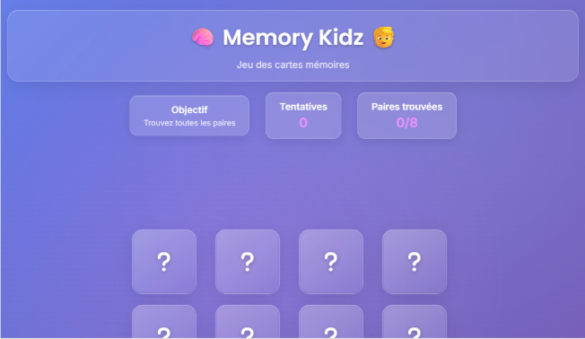

# 🧠 Memory Kidz – Jeu de cartes mémoires

Bienvenue sur **Memory Kidz**, un mini-jeu interactif pour tester votre mémoire.  
Le but : retrouver toutes les paires le plus rapidement possible, avec un minimum d’erreurs.

---

## 🎮 Aperçu



---

## 🚀 Démo en ligne

👉 [Jouer maintenant](https://gdevweb.github.io/Game-Memory-Card/)

---

## 🛠️ Technologies utilisées

- **HTML5** – structure sémantique
- **CSS3** – stylisation + animations fluides
- **JavaScript** – logique du jeu
- **TypeScript** – refactorisation en cours pour plus de robustesse

---

## 🕹️ Comment jouer

1. Cliquez sur une carte pour la retourner.
2. Tentez de retrouver les paires identiques.
3. Le jeu se termine quand toutes les paires sont découvertes !

---

## ⚙️ Installation locale

```bash
git clone https://github.com/GDevWeb/Game-Memory-Card.git 
cd Game-Memory-Card
```

Puis ouvrez simplement le fichier `index.html` dans votre navigateur.

---

## 📝 Mises à jour

- ✅ **24/06/2024** – Fix logique "unfair" sur paires incorrectes
- 🔄 Migration progressive vers **TypeScript**
- 🎨 Nouvelle version UI design (Memory Kidz v2)

---

## ✨ Crédits

- Développement & design : [Gaëtan Dammaretz](https://github.com/Aescanor)
- Illustrations et icônes : création personnelle

---

## 📬 Contact

- GitHub : [@GD@evWeb](https://github.com/GDevWeb)
- LinkedIn : [Gaëtan Dammaretz](https://www.linkedin.com/in/gaëtan-dammaretz)

---

© 2025 – _Projet personnel open-source à but pédagogique._
